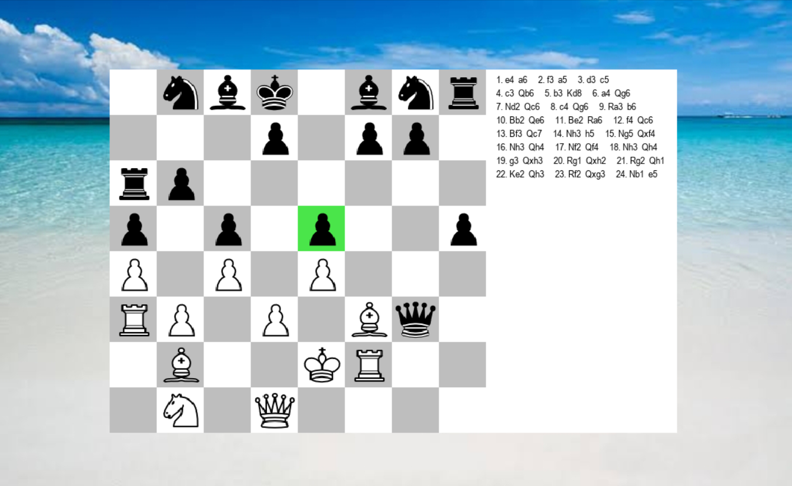

# Chess Engine

This repository contains a Python-based chess game implementation. It includes various scripts for gameplay and additional project files for setting up the environment.

## File Structure

Chess.py: Main file for the chess game logic.

p1.py: Player 1 logic for the game.

p2.py: Player 2 logic for the game.

__init__.py: Initialization file for the chess module.

__pycache__: Compiled Python files.

images/: Folder containing images related to the chess game.

.idea/: Configuration files for the project in IntelliJ or PyCharm.

## Project Output

## Requirements

To run this project, you will need Python installed. You can install the required dependencies using pip:

`pip install -r requirements.txt`

If no requirements.txt file is available, manually install any dependencies you may find in the scripts.

## IDE

For an optimal development experience, it is recommended to use PyCharm or IntelliJ IDEA with the Python plugin. These IDEs provide excellent support for Python development including:

- Code completion
- Debugging
- Project management
- Integrated Git support

Alternatively, Visual Studio Code with the Python extension can also be used for editing and running the code.

## Game Logic and Algorithms

**Negamax Algorithm**: A simplified version of the Minimax algorithm used for decision-making in two-player zero-sum games like chess. It evaluates the game tree by recursively exploring possible moves and choosing the one that maximizes the player's advantage.

**Alpha-Beta Pruning**: An optimization technique for the Negamax algorithm that reduces the number of nodes evaluated in the game tree, improving performance by "pruning" branches that won't be selected.

**Reinforcement Learning**: Used to enhance the AI player by learning from interactions with the environment, where the model is trained to improve its gameplay strategy over time through rewards and penalties.

## Usage

To start the chess game, run the Chess.py file:

`python Chess.py`

This will initialize the chess game and allow you to start playing.

## License

This project is licensed under the MIT License - see the LICENSE file for details.
